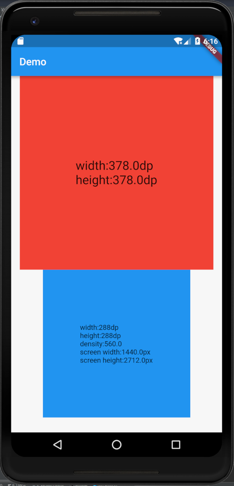
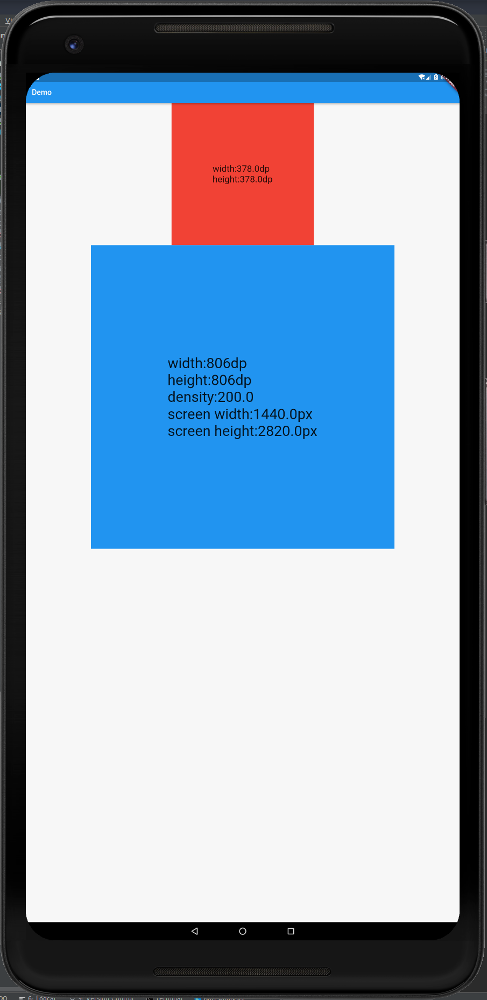
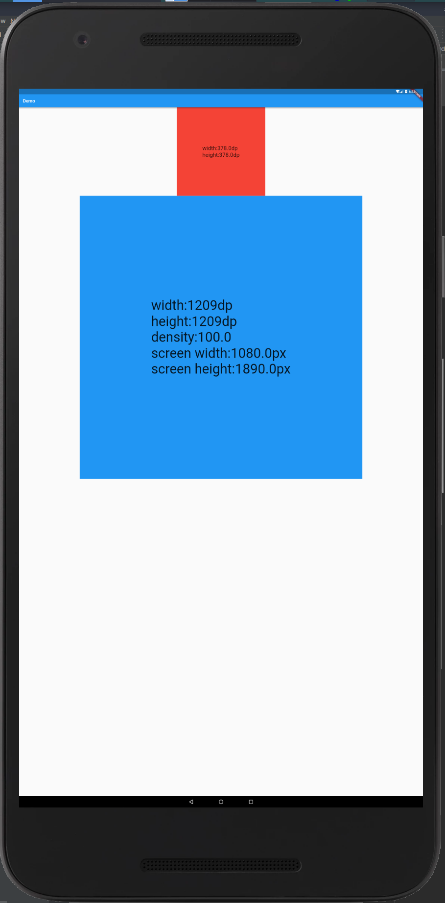

# design2ui
[中文文档](README-CN.md)

UI adaptation plugin, so that the interface and font display the same effect on the different ppi phones

* Scale based on the design pixel density
* Scale according to the design map dp and the corresponding px
* Scale according to design width and pixel

## Instructions:

* Import design2ui.dart
   ```dart
   import 'package:design2ui/design2ui.dart';
   ```

* Init
   Initialize on the home page
   ```dart
   D2U.init(context);
   ```

* Load design settings
   * Know the pixel ratio and width of the design, assuming the design width is 1080px/540dp
     ```dart
     D2U.load(D2UDesign(2.0,540.0));
     ```
   * Know the design map ppi and width, assuming the design map ppi is 320, width 540dp, can also be px
     ```dart
     D2U.load(D2UDesign.fromDensity(320,widthDp:540.0));
     D2U.load(D2UDesign.fromDensity(320,widthPx:1080));
     ```
   * Know the design dp and px, assuming the design image has an icon width of 540dp/1080px
     ```dart
     D2U.load(D2UDesign.fromCompare(540.0,1080));
     ```
   * Only know the design width dp or px (fill in px, use px and dp effect is the same)
     ```dart
     D2U.load(D2UDesign.fromSize(widthDp:540.0));
     D2U.load(D2UDesign.fromSize(widthPx:1080));
     ```

* Usage
   * Set width and height:D2U.d2u(dp:dp,px:px);
     ```dart
     Container(
       width: D2U.d2u(dp: 100.0),
       height: D2U.d2u(dp: 100.0),
     )
     ```
   * Font settings can choose whether to follow the system zoom
     ```dart
     //scale:false
     TextStyle(
       fontSize: D2U.d2ut(24.0),
     )

     //scale
     TextStyle(
       fontSize: D2U.d2ut(24.0,scale: true),
     )
     ```

## [`example`](example/lib/main.dart):


