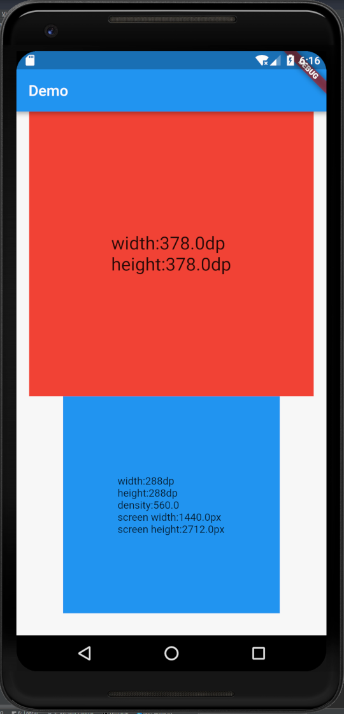
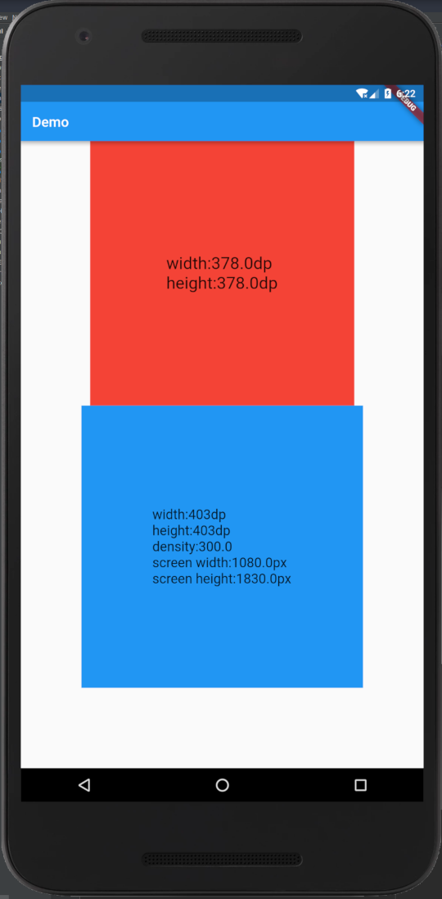
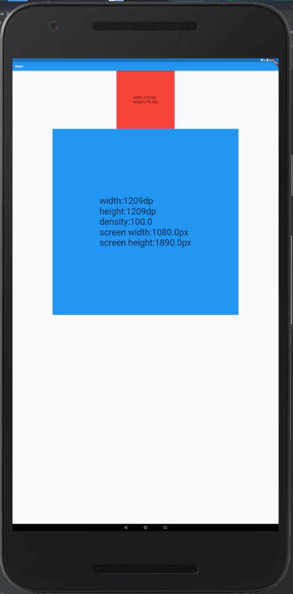

# Example
design width: `540dp`/`1080px`
* Initialization
   ```dart
    D2U.init(context);
    D2U.load(D2UDesign.fromCompare(540.0, 1080));
   ```
* Use

   The design has a square of 378dp size and color is blue
   ```dart
   Container(
                   width: D2U.d2u(dp: 378.0),
                   height: D2U.d2u(dp: 378.0),
                   color: Colors.blue,
                   child: Center(
                     child: Text(
                       'width:${D2U.d2u(dp: 378.0).floor()}dp\n'
                           'height:${D2U.d2u(dp: 378.0).floor()}dp\n'
                           'density:${D2U.defaultDensity * D2U.pixelRatio}\n'
                           'screen width:${D2U.screenWidth * D2U.pixelRatio}px\n'
                           'screen height:${D2U.screenHeight * D2U.pixelRatio}px',
                       style: TextStyle(
                         fontSize: D2U.d2ut(18.0),
                       ),
                     ),
                   ),
                 ),
   ```

## screenshot:



